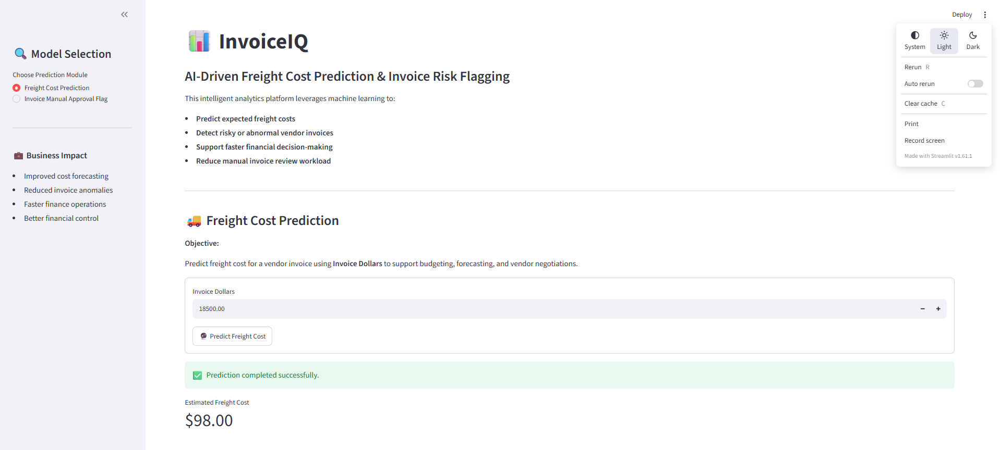
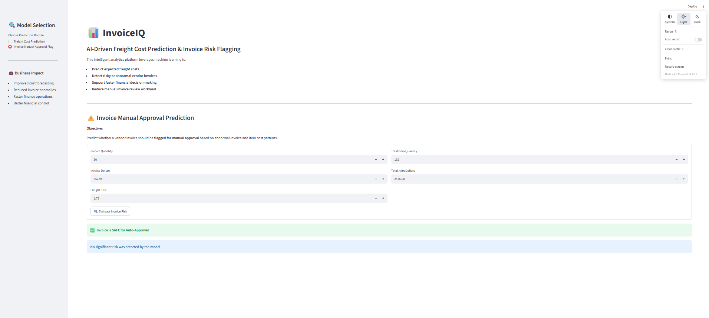
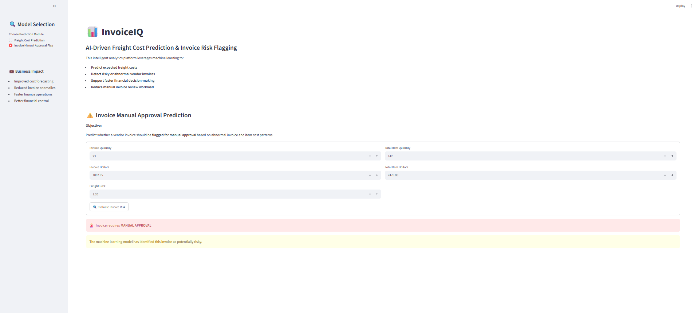

# 📊 InvoiceIQ

### AI-Powered Vendor Invoice Intelligence Platform

**InvoiceIQ** is an end-to-end Machine Learning application designed to help finance teams analyze vendor invoices, predict expected freight costs, and identify invoices that may require manual approval.

The platform combines **Machine Learning, Python, Scikit-learn, and Streamlit** to provide an interactive interface for financial analysis and invoice risk assessment.

---

## 🚀 Project Overview

InvoiceIQ provides two major machine learning capabilities:

### 1. 🚚 Freight Cost Prediction

Predicts the expected freight cost of a vendor invoice based on the **Invoice Dollars** value.

The trained regression model learns the relationship between invoice value and freight cost and provides an estimated freight amount for a new invoice.

### 2. ⚠️ Invoice Risk Flagging

Predicts whether a vendor invoice should be:

- ✅ **Safe for Auto-Approval**
- 🚨 **Flagged for Manual Approval**

The classification model evaluates invoice-related features and identifies potentially abnormal invoices.

---

## 🎯 Business Objectives

The main objectives of InvoiceIQ are:

- Predict expected freight costs for vendor invoices.
- Identify potentially abnormal or risky invoices.
- Reduce manual invoice review workload.
- Support faster financial decision-making.
- Improve invoice monitoring and control.
- Help finance teams identify invoices that may require additional investigation.
- Provide an easy-to-use interface for interacting with trained ML models.

---

## 🧠 Machine Learning Modules

### 🚚 Freight Cost Prediction

**Problem Type:** Regression

**Target Variable:**

```text
Freight
```

**Feature Used:**

```text
Dollars
```

The model predicts the expected freight cost from the invoice dollar amount.

### Example

```text
Invoice Dollars → ML Model → Predicted Freight
```

Example prediction:

```text
Invoice Dollars: $18,500
Predicted Freight: $98
```

---

### ⚠️ Invoice Risk Flagging

**Problem Type:** Binary Classification

**Target Variable:**

```text
flag_invoice
```

The model predicts:

```text
0 → Safe for Auto-Approval
1 → Manual Approval Required
```

### Features Used

The final classification model uses the following five features:

```text
invoice_quantity
invoice_dollars
Freight
total_item_quantity
total_item_dollars
```

---

## 🤖 Models Used

### Freight Cost Prediction

The project evaluates multiple regression algorithms:

- Linear Regression
- Decision Tree Regression
- Random Forest Regression

The models are evaluated using:

- Mean Absolute Error (MAE)
- Root Mean Squared Error (RMSE)
- R² Score

The best-performing model is selected based on the lowest MAE and saved for inference.

---

### Invoice Risk Flagging

The project uses:

**Random Forest Classifier**

Hyperparameter tuning is performed using:

```text
GridSearchCV
```

The model is optimized using **F1 Score**, which is useful for classification problems where correctly identifying risky invoices is important.

---

## 📊 Model Evaluation

### Invoice Risk Classification

The Random Forest Classifier achieved approximately:

| Metric | Score |
|---|---:|
| Accuracy | 87.47% |
| Precision | 93.91% |
| Recall | 68.23% |
| F1 Score | 79.03% |

These results indicate that the model provides high precision when identifying invoices as potentially risky, while maintaining reasonable recall.

---

## 🔍 Data Processing

The project uses a SQLite database containing vendor invoice and purchase information.

The data processing pipeline includes:

1. Loading data from SQLite.
2. Selecting relevant features.
3. Creating invoice risk labels.
4. Splitting data into training and testing datasets.
5. Scaling numerical features where required.
6. Training machine learning models.
7. Evaluating model performance.
8. Saving trained models using Joblib.
9. Using saved models for inference.

---

## 🏷️ Invoice Risk Label Generation

Invoice risk labels are generated using business rules based on invoice and purchase information.

An invoice can be flagged when there is a significant difference between:

```text
Invoice Dollars
```

and

```text
Total Item Dollars
```

or when the receiving delay exceeds the defined threshold.

The resulting target variable is:

```text
flag_invoice
```

where:

```text
0 → Normal / Safe
1 → Risky / Manual Review
```

---

## 🖥️ Streamlit Application

InvoiceIQ provides an interactive **Streamlit dashboard**.

The application contains two modules.

### Freight Cost Prediction

Users enter:

```text
Invoice Dollars
```

The application then displays:

```text
Estimated Freight Cost
```

### Invoice Risk Prediction

Users enter:

```text
Invoice Quantity
Invoice Dollars
Freight Cost
Total Item Quantity
Total Item Dollars
```

The application returns either:

```text
✅ Invoice is SAFE for Auto-Approval
```

or:

```text
🚨 Invoice requires MANUAL APPROVAL
```

---

## 📸 Application Screenshots

### 🏠 Freight Cost Prediction


### 🚚 Invoice Flagging 



### ⚠️ Invoice Risk Flagging




## 🏗️ System Architecture

```text
                    ┌─────────────────────┐
                    │   Vendor Invoice    │
                    │       Data          │
                    └──────────┬──────────┘
                               │
                               ▼
                    ┌─────────────────────┐
                    │   Data Processing   │
                    │     & Cleaning      │
                    └──────────┬──────────┘
                               │
                ┌──────────────┴──────────────┐
                │                             │
                ▼                             ▼
      ┌──────────────────┐          ┌──────────────────┐
      │ Freight Prediction│          │ Invoice Flagging │
      │    Regression     │          │  Classification  │
      └────────┬─────────┘          └────────┬─────────┘
               │                             │
               ▼                             ▼
      ┌──────────────────┐          ┌──────────────────┐
      │ Predicted Freight│          │ Risk Prediction  │
      └────────┬─────────┘          └────────┬─────────┘
               │                             │
               └──────────────┬──────────────┘
                              │
                              ▼
                    ┌─────────────────────┐
                    │ Streamlit Dashboard │
                    └─────────────────────┘
```

---

## 🛠️ Technology Stack

### Programming Language

- Python

### Machine Learning

- Scikit-learn
- Linear Regression
- Decision Tree
- Random Forest
- GridSearchCV

### Data Processing

- Pandas
- NumPy

### Model Evaluation

- MAE
- RMSE
- R² Score
- Accuracy
- Precision
- Recall
- F1 Score

### Database

- SQLite

### Web Application

- Streamlit

### Model Serialization

- Joblib

### Development Tools

- VS Code
- Jupyter Notebook
- Git
- GitHub

---

## 📁 Project Structure

```text
InvoiceIQ/
│
├── app.py
├── README.md
├── requirements.txt
│
├── inference/
│   ├── predict_freight.py
│   └── predict_invoice_flag.py
│
├── models/
│   ├── predict_freight_model.pkl
│   ├── predict_flag_invoice.pkl
│   └── scaler.pkl
│
├── freight_cost_prediction/
│   ├── train.py
│   ├── data_preprocessing.py
│   ├── modeling_evaluation.py
│   └── models/
│
├── invoice_flagging/
│   ├── train.py
│   ├── data_preprocessing.py
│   └── Model_evaluation.py
│
└── data/
    └── inventory.db
```

> **Note:** The local SQLite database is not required to be uploaded to GitHub because of its large file size and is excluded using `.gitignore`.

---

## ⚙️ Installation

Clone the repository:

```bash
git clone https://github.com/Konikkalal/InvoiceIQ.git
```

Navigate to the project:

```bash
cd InvoiceIQ
```

Create a virtual environment:

### Windows

```bash
python -m venv venv
```

Activate it:

```bash
venv\Scripts\activate
```

Install dependencies:

```bash
pip install -r requirements.txt
```

---

## ▶️ Run the Application

Start the Streamlit application:

```bash
streamlit run app.py
```

The application will open in your browser.

---

## 🔮 Example Freight Prediction

Input:

```text
Invoice Dollars = 18500
```

Output:

```text
Estimated Freight Cost = $98
```

The prediction is generated using the trained regression model.

---

## 🚨 Example Invoice Risk Prediction

Example input:

```text
Invoice Quantity      = 50
Invoice Dollars       = 352.95
Freight               = 1.73
Total Item Quantity   = 162
Total Item Dollars    = 2476
```

The Random Forest Classifier evaluates the invoice and returns:

```text
Safe for Auto-Approval
```

or:

```text
Manual Approval Required
```

---

## 🔐 Data & Security Note

The project uses invoice and purchase-related data for machine learning analysis.

Sensitive production financial data should not be committed to a public repository.

For production deployment:

- Use secure databases.
- Protect credentials using environment variables.
- Apply authentication and authorization.
- Avoid exposing sensitive financial information.
- Use secure cloud storage for production datasets.

---

## 📈 Future Improvements

Potential future improvements include:

- Real-time integration with ERP systems.
- Automated invoice ingestion.
- Vendor-wise risk scoring.
- Fraud and anomaly detection.
- Explainable AI for invoice decisions.
- Automated email notifications for flagged invoices.
- Advanced model monitoring.
- Model retraining pipelines.
- Cloud deployment.
- Role-based access control.
- Dashboard analytics for finance teams.
- Historical invoice trend analysis.

---

## 🌐 Deployment

The Streamlit application can be deployed using **Streamlit Community Cloud**.

Deployment configuration:

```text
Repository: Konikkalal/InvoiceIQ
Branch: main
Main file: app.py
```

---

## 📌 Key Learning Outcomes

Through this project, the following concepts were implemented:

- End-to-end Machine Learning workflow
- Regression modeling
- Binary classification
- Feature engineering
- Data preprocessing
- Train-test splitting
- Feature scaling
- Hyperparameter tuning
- GridSearchCV
- Model evaluation
- Model serialization
- Model inference
- Streamlit application development
- Git and GitHub
- ML model integration with a web application

---

## 👨‍💻 Author

### Konik Kalal

B.Tech – Artificial Intelligence & Data Science

Jaipur Engineering College and Research Centre (JECRC)

GitHub:

https://github.com/Konikkalal

---

## ⭐ Project

If you find this project useful, consider giving the repository a ⭐ on GitHub.

---

## 📄 License

This project is intended for educational and portfolio purposes.
